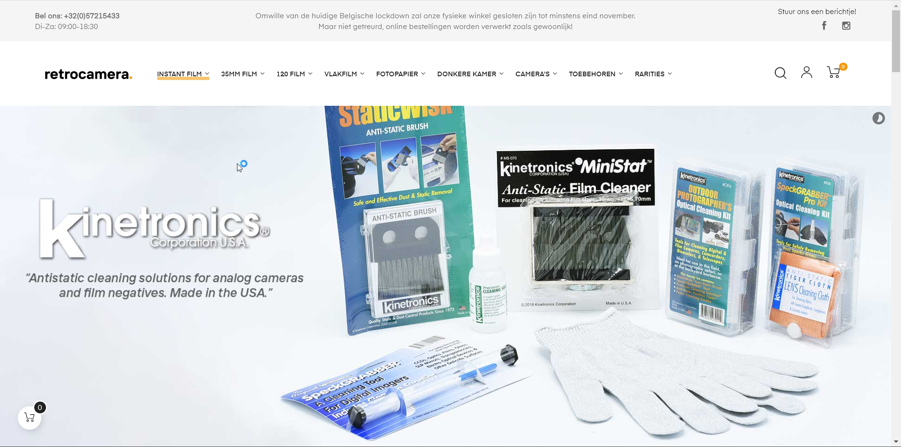

# Procesverslag
**Auteur:** -Ediz Yegenoglu-

Markdown cheat cheet: [Hulp bij het schrijven van Markdown](https://github.com/adam-p/markdown-here/wiki/Markdown-Cheatsheet). Nb. de standaardstructuur en de spartaanse opmaak zijn helemaal prima. Het gaat om de inhoud van je procesverslag. Besteedt de tijd voor pracht en praal aan je website.

## Bronnenlijst
1. -https://www.codegrepper.com/code-examples/css/remove+list+markers+from+a+html+list-
2. -https://www.w3schools.com/howto/howto_css_style_hr.asp-
3. -https://www.w3schools.com/howto/howto_css_flip_image.asp-
4. -https://www.w3schools.com/howto/howto_css_display_element_hover.asp-
5. -https://codepen.io/tojowe/pen/dFmtA-
6. -https://www.sitepoint.com/community/t/should-i-really-use-h1-element-as-a-logo/246927/3-
7. -https://drafts.csswg.org/selectors-3/#nth-of-type-pseudo-
8. -https://www.w3schools.com/howto/howto_js_toggle_hide_show.asp -
9. -https://www.warrenchandler.com/2019/04/29/half-and-half-background-colour-using-css/-
10. -https://www.codeblocq.com/2016/05/Blur-Image-on-Hover-with-CSS/-
11. -https://codepen.io/juliogcampos/pen/BzdjwY-
12. -https://www.youtube.com/watch?v=D7sNpAiNMQM&ab_channel=dcode-
13. -https://www.codegrepper.com/code-examples/javascript/jquery+do+something+every+x+seconds-
14. -https://www.w3schools.com/jsref/prop_img_src.asp-
15. -https://stackoverflow.com/questions/25868014/html-margin-issue-shaking-website-
16. -https://www.w3.org/Style/Examples/007/evenodd.en.html-
17. -https://www.w3schools.com/howto/howto_css_hide_arrow_number.asp-
18. --

## Eindgesprek (week 7/8)

-Af en toe liep ik vast en moest ik wat stappen terug voor ik verder kon. bijvoorbeeld dat het bij mijn js niet helemaal goed ging waardoor ik 2 bestanden heb gebruikt.
verder ben ik wel blij met het resultaat en hoe het gegaan is want in het algemeen was het wel chill om met mijn eigen tempo er aan te werken.-

**Screenshot(s):**

## Voortgang 3 (week 6)

### Stand van zaken
-nu bezig met de navigatie responsive af te maken, moet daarvoor eerst dingen aanpassen. het dropdown menu komt achter de slider terecht, ik moet een manier vinden om dat op te lossen. Verder moet ik de hele pagina nog vullen met alle content en de 2e pagina helemaal maken. Op css-tricks almanacs nog kijken voor leuke dingen. -

**Screenshot(s):**

<!--  -->
<!--  -->

### Agenda voor meeting

-samen met je groepje opstellen-

-Ediz: vragen waarom ik naar links kan scrollen. Vragen hoe ik het menu fix. -
-student2-
-student3-
-student4-

### Verslag van meeting

- de meeting ging goed, ik moet wel nog veel doen tijdens de vakantie-

## Voortgang 2 (week 5)

### Stand van zaken
-Ik ben bezig geweest met het veranderen van alle code, ik gebruik geen div meer en nog maar een enkele klas die nodig zijn voor js. Wel zei de student assistent dat ik nu echt wel de 2e pagina ook al gestijlt moet hebben terwijl ik nog rustig bezig ben met de 1e. Ik werk een beetje van boven naar beneden. ik heb tot nu toe wel al gewerkt aan wat dingen responsive te maken.-

**Screenshot(s):**

### Agenda voor meeting

-samen met je groepje opstellen-

-Ediz: Hoe haal ik een class weg waar nth of type niet werkt?-
-student2-
-student3-
-student4-

### Verslag van meeting

-inplaats van een enkele class om iets specifieks aan te pakken omdat :nth of type me daar niet op iets goeds bracht de boel vervangen voor header > button. niet alles hoeft precies zoals de echte site te zijn.-

## Voortgang 1 (week 3)

### Stand van zaken

-Ik kreeg hier te horen dat classes en div niet gebruikt mochten worden dus moest een hoop veranderen. Ik heb een begin aan de eerste pagina. ik heb geleerd dat je een plaatje van kleur kan laten veranderen en animeren door svg te gebruiken inplaats van de png's die ik had.-

**Screenshot(s):**

-Deze screenshot is van iets na de eerste voortgang maar visueel is er nog niet veel veranderd. er is ook een begin aan een werkend hamburger menu.-

### Agenda voor meeting

-samen met je groepje opstellen-

-Ediz: Hoe maak ik het icoontje ook oranje bij :hover?-
-student2-
-student3-
-student4-

### Verslag van meeting

-geen classes, geen div. svg inplaats van img. Producten hoeven niet in een list te komen, alle article kunnen los in een grid.-

## Breakdownschets (week 1)

-uitwerken voor de 1e werkgroep - eind van de eerste week-

## Intake (week 1)
-uitwerken voor de kick-off werkgroep - begin van de eerste week-

**Je startniveau:** -rood-

**Je focus:** -responsive-

**Je opdracht:** -https://www.retrocamera.be/nl/-

**Screenshot(s) van de eerste pagina (small screen):**

**Screenshot(s) van de tweede pagina (small screen):**

